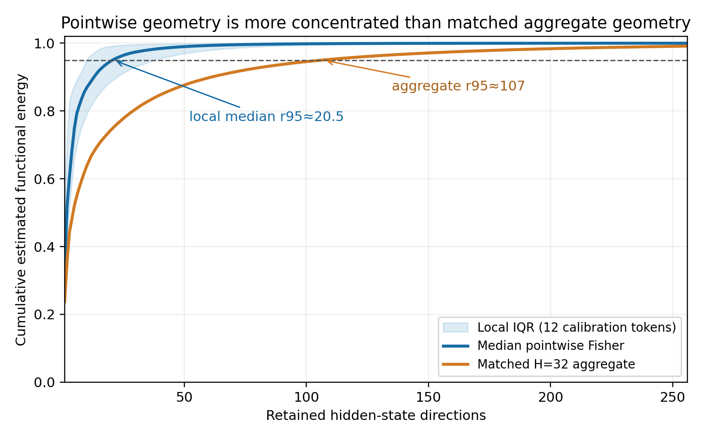
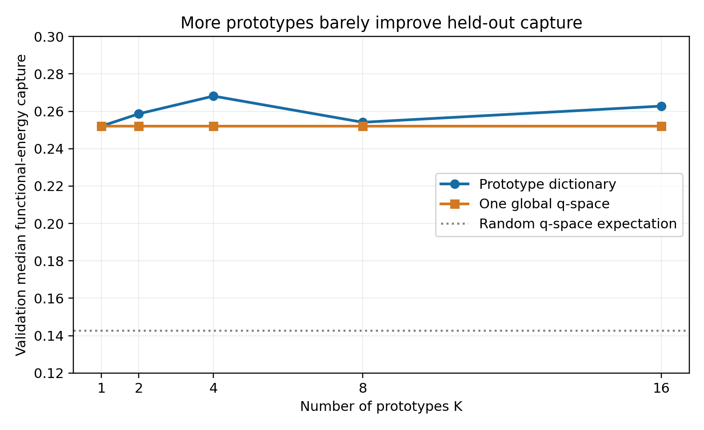

# Functional Geometry and Compressibility in Transformers

Can pretrained transformer computation be represented more cheaply without losing its function? This project explores that question through predictive KV coding, compute-matched block surrogates, and downstream Fisher geometry in Qwen2.5-0.5B-Instruct. The experiments progressively narrowed the original compression hypothesis to a structural observation: downstream functional geometry can be highly concentrated at an individual token even when it is much more complex in aggregate.

## Experiments

| Hypothesis | Main comparison | Outcome |
|---|---|---|
| KV states are predictively compressible | Learned temporal predictors vs. previous-token differencing | Not supported |
| Transformer blocks become simple in learned coordinates | Latent-linear surrogates vs. compute-matched nonlinear controls | Not supported |
| One small global subspace captures downstream sensitivity | Aggregate downstream Fisher spectrum | Not supported |
| Individual tokens have concentrated functional geometry | Pointwise vs. matched aggregate Fisher spectra | **Supported in this setting** |
| Local subspaces recur as a small dictionary | Train-fitted Grassmann prototypes vs. one matched global subspace | Not supported |

Every learned component was fit on sequence-disjoint training data, hyperparameters were selected on validation data, and final comparisons used untouched test data. Claims about compression were evaluated through causal intervention, rate–distortion, or next-token behavior rather than reconstruction error alone.

## Main result

At the residual stream after zero-based block 10, downstream Fisher geometry was estimated over a fixed 32-token causal horizon. The median validation estimate required **27 of 896 dimensions** to account for 95% of pointwise functional energy, while the corresponding matched aggregate estimate required approximately **107 dimensions**.



This local concentration suggested a stronger possibility: perhaps the model switches among a small number of recurring functional subspaces. That hypothesis did not hold. A validation-selected dictionary of eight 128-dimensional Grassmann prototypes captured **26.2%** median functional energy on untouched test tokens, compared with **25.4%** for one matched global subspace. In other words, local low rank did not translate into a compact reusable dictionary of functional regimes.



The pointwise spectra use stochastic score-VJP estimates, so their interpretation depends on the estimator and its finite probe budget. The precise rank-cap and tail limitations are documented in the [methodology](docs/methodology.md) and [reproducibility guide](docs/reproducibility.md).

## How the project evolved

1. **Predictive KV coding.** High adjacent-state similarity initially suggested that new cache states might be predicted rather than stored. Previous-token differencing captured most of the useful temporal redundancy; AR models, token×depth prediction, conditional transforms, and heterogeneous codecs did not add a material advantage after realistic overhead.
2. **Block compilation.** The next experiment tested whether transformer blocks could be replaced by cheap learned dynamics. At matched compute, latent-linear models did not outperform ordinary nonlinear surrogates, and multi-block replacements remained too damaging.
3. **Aggregate functional geometry.** Hidden-state error might emphasize directions that the rest of the network barely uses, motivating an estimate of the downstream pullback Fisher metric. The aggregate geometry remained too high-dimensional for the intended compression argument, and its quadratic form only marginally improved prediction of finite replacement damage.
4. **Local functional geometry.** Estimating the same geometry pointwise revealed substantially more concentrated spectra than the matched aggregate.
5. **Reusable regimes.** Train-only subspace clustering tested whether those local geometries formed a small recurring dictionary. Held-out capture barely improved over a single global subspace, separating the supported local-concentration result from the unsupported compression interpretation.

The detailed progression, including the strongest baseline for each experiment, is in the [research story](docs/research_story.md) and [negative-results record](docs/negative_results.md).

## Key lessons

- High cosine similarity between adjacent KV states does not guarantee a useful predictive coding advantage.
- A learned coordinate system is not evidence of simple latent dynamics unless it beats an equally cheap nonlinear model.
- Hidden-state reconstruction error alone is not a reliable measure of downstream functional fidelity.
- Aggregate functional geometry can be substantially more complex than pointwise geometry.
- Concentrated local subspaces need not recur in a form that supports a small shared dictionary.

## Methods and reproducibility

The repository includes:

- causal K/V and residual-stream interventions;
- entropy-coded KV rate–distortion evaluation with reconstructed predictor history;
- compute-matched linear, low-rank, MLP, latent-linear, and latent-nonlinear block surrogates;
- downstream categorical Fisher estimation using batched score VJPs;
- pointwise eigenspectrum and Grassmannian subspace analysis;
- synthetic CPU tests for the core numerical and intervention utilities.

Install the package and run the lightweight tests:

```bash
git clone https://github.com/henry550xz/transformer-functional-geometry.git
cd transformer-functional-geometry
python -m venv .venv
source .venv/bin/activate
pip install -e ".[experiments,test]"
pytest -q
```

Run a small, explicitly approximate geometry demonstration:

```bash
python scripts/reproduce_core_geometry.py \
  --model Qwen/Qwen2.5-0.5B-Instruct \
  --layer 10 --horizon 32 --quick \
  --output outputs/demo
```

The validated estimator used 384 probes and the original sequence-disjoint corpus:

```bash
python scripts/reproduce_core_geometry.py \
  --model Qwen/Qwen2.5-0.5B-Instruct \
  --layer 10 --horizon 32 --probes 384 \
  --text-file /path/to/your_redistributable_corpus.txt \
  --output outputs/full
```

The original corpus, pretrained weights, raw activations, KV tensors, Fisher tensors, and training checkpoints are not redistributed. A user-supplied text file can be used to regenerate the analysis.

Further details:

- [Methodology](docs/methodology.md)
- [Reproducibility](docs/reproducibility.md)
- [Core validated results](results/core_results.md)
- [Literature context](docs/literature_context.md)
- [Reusable implementation](src/functional_geometry)

## Limitations

These results come from one model family and one main intervention setting. The local-versus-aggregate observation needs broader replication before it can be treated as a general property of transformers, and the current experiments do not establish a practical compression method.

## License

Original code and documentation are available under the [MIT License](LICENSE). Model and dataset licenses remain separate.
