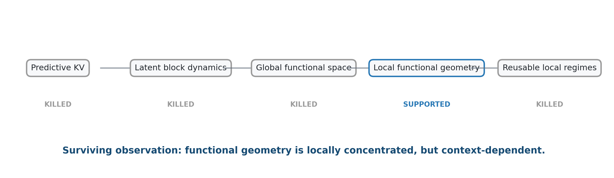

# Functional Geometry and Compressibility in Transformers

> How much of transformer computation is actually compressible? This repository documents a sequence of controlled experiments testing predictive KV coding, learned block surrogates, downstream Fisher geometry, and context-dependent local subspaces in a pretrained language model.



## Key result

On Qwen2.5-0.5B-Instruct, at the residual stream after zero-based block 10, pointwise downstream Fisher geometry over a fixed 32-token causal horizon was highly concentrated: the validation median estimated rank required for 95% functional energy was **27 of 896 dimensions**. A matched aggregate estimate required approximately **107 dimensions**, while an earlier, differently defined all-future aggregate required 432.

The stronger hypothesis did not survive. A validation-selected dictionary of eight 128-dimensional Grassmann prototypes captured only **26.2%** median functional energy on untouched test tokens, versus **25.4%** for one matched global subspace—a gain of roughly one percentage point. Local geometry was concentrated, but its orientation did not collapse into a small reusable set of regimes.

These ranks come from 384-probe stochastic score-VJP covariance estimates with rank cap 383; 256 leading eigenvectors were retained. Exact unobserved-tail ranks are not claimed. See [methodology](docs/methodology.md) and [reproducibility](docs/reproducibility.md).


## Research questions

| Question | Empirical answer |
|---|---|
| Can new KV states be predicted more cheaply than simple differencing? | Mostly no: delta coding captured most useful temporal redundancy. |
| Can transformer blocks be compiled into cheap latent-linear dynamics? | No: latent linearity did not beat compute-matched nonlinear controls. |
| Is downstream-visible residual space globally low-dimensional? | Not enough for the intended compression claim. |
| Is functional geometry context-dependent? | Yes: pointwise geometry was concentrated, but reusable regime dictionaries failed. |

## What survived the falsification funnel?

The project progressively narrowed a broad compression intuition:

1. Temporal KV prediction did not materially beat strong delta baselines after overhead.
2. Learned latent-linear block surrogates were not special relative to ordinary nonlinear surrogates.
3. One global downstream-visible subspace remained too large, and its quadratic metric poorly predicted finite replacement damage.
4. Pointwise functional subspaces were much smaller.
5. Those local subspaces did **not** recur as a small useful dictionary.

The surviving observation is structural rather than a compression method: **transformer functional geometry can be locally concentrated and strongly context-dependent at the same time.**


## Why publish negative results?

Most research repositories expose only the final successful method. This repository keeps the hypothesis-testing path visible so that encouraging intermediate signals—high cosine similarity, low hidden-state error, or a concentrated local spectrum—can be evaluated against stronger causal and functional tests.

The goal is to show which intuitions survive realistic baselines, actual downstream interventions, explicit train/validation/test separation, and predeclared go/no-go criteria. Negative outcomes are useful when they sharply reduce uncertainty.

## What I built

- Causal K/V and residual-stream interventions in a pretrained decoder.
- Actual entropy-coded KV rate–distortion evaluation with reconstructed predictor history.
- Compute-matched dense, low-rank, MLP, latent-linear, and latent-nonlinear block surrogates.
- Empirical downstream Fisher estimation using batched categorical score VJPs.
- Pointwise functional eigenspectrum analysis with explicit Monte Carlo rank-cap accounting.
- Grassmannian subspace comparison, train-only clustering, prototype stability, and random-null controls.
- Strict sequence-level train/validation/test separation and deterministic experiment scorecards.

## What I learned

1. High adjacent-state similarity does not guarantee a useful predictive coding residual.
2. Learned latent linearity did not outperform ordinary compute-matched nonlinear surrogates.
3. Hidden-state reconstruction quality is not a sufficient proxy for downstream functional fidelity.
4. Aggregate downstream functional geometry can be substantially more complex than pointwise geometry.
5. Pointwise functional subspaces can be highly concentrated while failing to recur as a small reusable dictionary.

## Installation

```bash
git clone https://github.com/henry550xz/transformer-functional-geometry.git
cd transformer-functional-geometry
python -m venv .venv
source .venv/bin/activate
pip install -e ".[experiments,test]"
pytest -q
```

The unit tests are CPU-only and download no models.

## Reproduce the core geometry

Quick demonstration (approximate; fewer contexts and probes than the validated experiment):

```bash
python scripts/reproduce_core_geometry.py \
  --model Qwen/Qwen2.5-0.5B-Instruct \
  --layer 10 --horizon 32 --quick \
  --output outputs/demo
```

Full estimator settings:

```bash
python scripts/reproduce_core_geometry.py \
  --model Qwen/Qwen2.5-0.5B-Instruct \
  --layer 10 --horizon 32 --probes 384 \
  --text-file /path/to/your_redistributable_corpus.txt \
  --output outputs/full
```

The public repository intentionally does not redistribute the original natural-text corpus, pretrained weights, raw activations, KV tensors, Fisher tensors, or temporary checkpoints. The CLI accepts user-supplied text and downloads the named model under its own license and access terms.

## Repository guide

- [Research story](docs/research_story.md): the five-stage hypothesis sequence.
- [Methodology](docs/methodology.md): interventions, baselines, and Fisher estimator.
- [Negative results](docs/negative_results.md): what killed each plausible idea.
- [Reproducibility](docs/reproducibility.md): exact conventions and caveats.
- [Literature context](docs/literature_context.md): related concepts without novelty claims.
- [Core results](results/core_results.md): compact, provenance-oriented snapshot.
- [`src/functional_geometry`](src/functional_geometry): reusable tested primitives.

## Scope

This is an empirical research and engineering portfolio, not a state-of-the-art compression method or a novelty claim. It reports one model family and a bounded set of experiments; the strongest structural observation requires broader replication before it should be generalized.

## License and citation

Original code and documentation are available under the [MIT License](LICENSE). Model and dataset licenses remain separate. Citation metadata is provided in [CITATION.cff](CITATION.cff).

